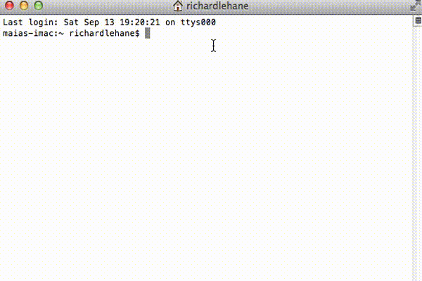

# Siegfried

[Siegfried](http://www.itforarchivists.com/siegfried) is a signature-based file format identification tool.

Key features are:

  - complete implementation of [PRONOM](http://apps.nationalarchives.gov.uk/pronom) (byte and container signatures)
  - fast matching without limiting the number of bytes scanned
  - detailed information about the basis for format matches
  - simple command line interface with a choice of outputs
  - a [built-in server](https://github.com/richardlehane/siegfried/wiki/Using-the-siegfried-server) for integrating with workflows and language inter-op
  - power options including [debug mode](https://github.com/richardlehane/siegfried/wiki/Inspect-and-Debug), [signature modification](https://github.com/richardlehane/siegfried/wiki/Building-a-signature-file-with-ROY), and [multiple identifiers](https://github.com/richardlehane/siegfried/wiki/Building-a-signature-file-with-ROY#one-signature-file-multiple-identifiers)

## Version

1.4.1

 

## Usage

### Command line

    sf file.ext
    sf DIR

#### Options

    sf -csv file.ext | DIR                     // Output CSV rather than YAML
    sf -json file.ext | DIR                    // Output JSON rather than YAML
    sf -droid file.ext | DIR                   // Output DROID CSV rather than YAML
    sf -known file.ext | DIR                   // Output list of recognised files
    sf -unknown file.ext | DIR                 // Output list of unrecognised files
    sf -                                       // Read list of files piped to stdin
    sf -nr DIR                                 // Don't scan subdirectories
    sf -z file.zip | DIR                       // Decompress and scan zip, tar, gzip, warc, arc
    sf -hash md5 file.ext | DIR                // Calculate md5, sha1, sha256, sha512, or crc hash
    sf -sig custom.sig file.ext                // Use a custom signature file
    sf -home c:\junk -sig custom.sig file.ext  // Use a custom home directory
    sf -debug file.ext                         // Scan in debug mode
    sf -slow file.ext | DIR                    // Report slow signatures
    sf -version                                // Display version information
    sf -serve hostname:port                    // Server mode

By default, siegfried uses the latest PRONOM and container signatures with no buffer limits. You can customise your signature file by using the [roy tool](https://github.com/richardlehane/siegfried/wiki/Building-a-signature-file-with-ROY).

## Install

### With go installed: 

    go get github.com/richardlehane/siegfried/cmd/sf

    sf -update

### Or, without go installed:

For OS X:

    brew install mistydemeo/digipres/siegfried

For Ubuntu/Debian (64 bit):

    wget -qO - https://bintray.com/user/downloadSubjectPublicKey?username=bintray | sudo apt-key add -
    echo "deb http://dl.bintray.com/siegfried/debian wheezy main" | sudo tee -a /etc/apt/sources.list
    sudo apt-get update && sudo apt-get install siegfried

For Win:

Download a pre-built binary from the [releases page](https://github.com/richardlehane/siegfried/releases). Unzip to a location in your system path. Then run:

	sf -update

## Recent Changes
### Version 1.4.1
- highlight empty file/stream with error and warning
- negative text match overrides extension-only plain text match

### Version 1.4.0 (31/10/2015)
- new MIME matcher; requested by [Dragan Espenschied](https://github.com/richardlehane/siegfried/issues/55)
- support warc continuations
- add all.json and tiff.json sets
- minor speed-up
- report less redundant basis information
- report error on empty file/stream

### Version 1.3.0 (27/9/2015)
- scan within warc and arc files with -z flag; reqested by [Dragan Espenschied](https://github.com/richardlehane/siegfried/issues/43)
- [quit scanning earlier on known unknowns](https://github.com/richardlehane/siegfried/commit/f7fedf6b629048e1c41a694f4428e94deeffd3ee)
- don't include byte signatures where formats have container signatures (unless -doubleup flag is given); fixes a mis-identification reported by [Ross Spencer](https://github.com/richardlehane/siegfried/issues/52)
- sf -slow FILE | DIR reports slow signatures
- sf -debug output simplified
- sf -version describes signature file; requested by [Michelle Lindlar](https://github.com/richardlehane/siegfried/issues/54)
- roy -limit and -exclude now operate on text and default zip matches
- roy -nopriority re-configured to return more results
- bugfix: upgraded versions of sf panic when attempting to read old signature files; reported by [Stefan](https://github.com/richardlehane/siegfried/issues/49) 
- bugfix: panic mmap'ing files over 1GB on Win32; reported by [Duncan](https://github.com/richardlehane/siegfried/issues/50) 
- bugfix: reporting extensions for folders with "."; reported by [Ross Spencer](https://github.com/richardlehane/siegfried/issues/51)

### Version 1.2.2 (15/8/2015)
- add -noext flag to roy to suppress extension matching; requested by [Greg Lepore](https://github.com/richardlehane/siegfried/issues/46)
- -known and -unknown flags for sf to output lists of recognised and unknown files respectively; requested by [Greg Lepore](https://github.com/richardlehane/siegfried/issues/47)

### Version 1.2.1 (11/8/2015)
- support annotation of sets.json files; requested by Greg Lepore
- add warning when use -extendc without -extend
- bugfix: report container extensions in details; reported by [Ross Spencer](https://github.com/richardlehane/siegfried/issues/48)

### Version 1.2.0 (31/7/2015)
- text matcher (i.e. sf README will now report a 'Plain Text File' result)
- -notext flag to suppress text matcher (roy build -notext)
- all outputs now include file last modified time
- -hash flag with choice of md5, sha1, sha256, sha512, crc (e.g. sf -hash md5 FILE)
- -droid flag to mimic droid output (sf -droid FILE)
- bugfix: [detect encoding of zip filenames](https://github.com/richardlehane/siegfried/commit/0c92c52d3d709e1a9b2822fa182ebd1847a6c394) reported by [Dragan Espenschied](https://github.com/richardlehane/siegfried/issues/42)
- bugfix: [mscfb](https://github.com/richardlehane/mscfb/commit/f790430b648469e862b40f599171e361e30442e7) reported by [Dragan Espenschied](https://github.com/richardlehane/siegfried/issues/41)

### Version 1.1.0 (17/5/2015)
- scan within archive formats (zip, tar, gzip) with -z flag
- format sets (e.g. roy build -exclude @pdfa)
- leaner, faster signature format
- support bitmask patterns
- mirror bof patterns as eof patterns where both roy -bof and -eof limits set
- 'sf -' reads files piped to stdin
- bugfix: [mscfb](https://github.com/richardlehane/mscfb/commit/22552265cefc80b400ff64156155f53a5d5751e6) reported by [Pascal Aantz](https://github.com/richardlehane/siegfried/issues/32)
- bugfix: race condition in scorer (affected tip golang)
- archivematica build: fpr server

### Version 1.0.0 (22/3/2015)
- [user documentation](http://github.com/richardlehane/siegfried/wiki)
- bugfixes (mscfb, match/wac and sf)
- QA using [comparator](http://github.com/richardlehane/comparator)

[Full change history](https://github.com/richardlehane/siegfried/wiki/Change-history)

## Rights

Copyright 2015 Richard Lehane 

Licensed under the [Apache License, Version 2.0](http://www.apache.org/licenses/LICENSE-2.0)

## Contributing

Like siegfried and want to get involved in its development? That'd be wonderful! There are some notes on the [wiki](https://github.com/richardlehane/siegfried/wiki) to get you started, and please get in touch.

## Thanks

Thanks TNA for http://www.nationalarchives.gov.uk/pronom/ and http://www.nationalarchives.gov.uk/information-management/projects-and-work/droid.htm

Thanks Ross for https://github.com/exponential-decay/skeleton-test-suite-generator and http://exponentialdecay.co.uk/sd/index.htm, both are very handy!

Thanks Misty for the brew and ubuntu packaging
